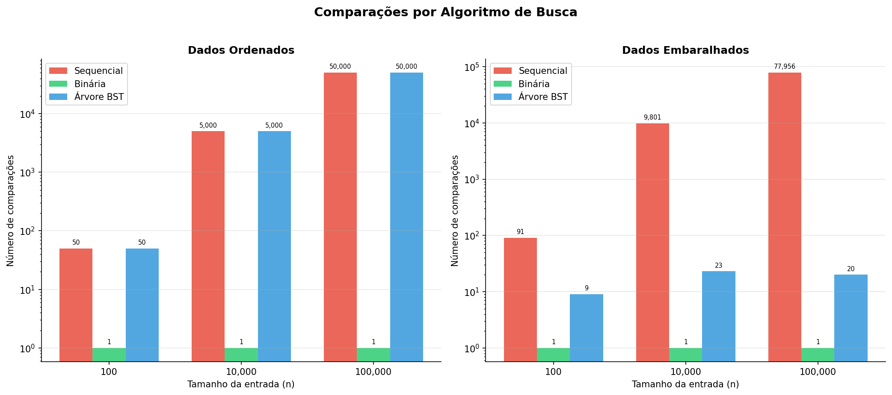
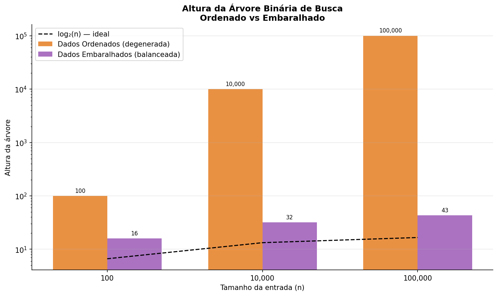

# Experimento: Comparação de Estratégias de Busca

Atividade prática de Estruturas de Dados — comparação entre busca sequencial, busca binária e busca em árvore binária de busca (BST).

---

## Como compilar e executar

```bash
# Compilar
make

# Executar os experimentos (cria resultados/ automaticamente)
mkdir -p resultados && ./experimento

# Gerar os gráficos (requer Python 3 e matplotlib)
python3 gerar_graficos.py
```

> **Experimentos com 1.000.000 e 1.000.000.000 de elementos** estão comentados em `src/main.c` por exigirem hardware dedicado (≥ 4 GB de RAM para 1B de inteiros). Descomente as linhas indicadas e recompile para executá-los em máquina local.

---

## Estrutura do repositório

```
atividade-arvores-busca/
├── src/
│   ├── main.c       — experimentos e medições
│   ├── arvore.c/.h  — árvore binária de busca
│   └── buscas.c/.h  — busca sequencial e binária
├── resultados/
│   ├── resultados.csv
│   ├── resumo.txt
│   ├── grafico_comparacoes.png
│   ├── grafico_altura_arvore.png
│   ├── arvore_Ordenados.dot
│   └── arvore_Embaralhados.dot
├── gerar_graficos.py
├── Makefile
└── README.md
```

---

## Resultados obtidos

### Tabela de comparações — valor buscado próximo do meio

| n       | Tipo         | Valor | Seq (comp) | Bin (comp) | Árvore (comp) | Altura |
|---------|--------------|-------|-----------|-----------|--------------|--------|
| 100     | Ordenados    | 50    | 50        | 1         | 50           | 100    |
| 100     | Embaralhados | 50    | ~50 (var) | 1         | ~9 (var)     | ~16    |
| 10.000  | Ordenados    | 5.000 | 5.000     | 1         | 5.000        | 10.000 |
| 10.000  | Embaralhados | 5.000 | ~5.000    | 1         | ~23          | ~32    |
| 100.000 | Ordenados    | 50.000| 50.000    | 1         | 50.000       | 100.000|
| 100.000 | Embaralhados | 50.000| ~50.000   | 1         | ~20          | ~43    |

> Valores com "var" ou "~" variam a cada execução (dados embaralhados). Resultados reais estão em `resultados/resultados.csv`.

### Gráficos

**Gráfico 1 — Comparações por algoritmo**


**Gráfico 2 — Altura da árvore**


### Arquivo DOT (desafio extra)

Os arquivos `resultados/arvore_Ordenados.dot` e `resultados/arvore_Embaralhados.dot` (gerados para n=100) podem ser visualizados com Graphviz:

```bash
dot -Tpng resultados/arvore_Ordenados.dot -o resultados/arvore_ordenada.png
dot -Tpng resultados/arvore_Embaralhados.dot -o resultados/arvore_embaralhada.png
```

---

## Análise crítica

### 1. Qual algoritmo teve menos comparações na maioria dos testes?

**A busca binária** teve consistentemente o menor número de comparações para dados do meio e do final. Para n=100.000, ela precisa de apenas 17 comparações (⌈log₂(100.000)⌉), enquanto a sequencial pode precisar de até 100.000.

A **árvore embaralhada** ficou próxima — ~20 comparações para n=100.000 — porque com dados aleatórios ela se comporta quase como uma árvore balanceada, com altura ≈ 2·log₂(n).

### 2. A busca em árvore foi sempre melhor que a busca sequencial? Explique.

**Não.** Quando os dados são inseridos em **ordem crescente**, a BST degenera em uma lista encadeada: cada nó tem apenas filho à direita. A altura passa a ser igual a n, e a busca percorre exatamente os mesmos passos que a busca sequencial — O(n) no pior caso.

Com **dados embaralhados**, a árvore é muito superior à sequencial, pois a altura média fica em torno de 2·log₂(n).

### 3. O que aconteceu com a árvore quando os valores foram inseridos em ordem crescente?

A árvore **degenerou em uma lista encadeada à direita**. Cada novo valor é maior que o anterior, então é sempre inserido como filho direito do nó mais profundo. A altura resultante é exatamente n (100 para n=100, 10.000 para n=10.000, etc.), eliminando toda a vantagem da estrutura hierárquica.

### 4. Por que a altura da árvore influencia diretamente a quantidade de comparações?

Em uma BST, a busca percorre um **caminho da raiz até um nó folha** (ou até não encontrar o valor). O comprimento máximo desse caminho é exatamente a altura da árvore. Portanto, o número de comparações no pior caso é igual à altura:

- Árvore balanceada (altura ≈ log₂n): busca em O(log n)
- Árvore degenerada (altura = n): busca em O(n) — equivalente à lista

### 5. Por que a busca binária exige dados ordenados?

A busca binária decide em qual metade continuar com base na comparação entre o alvo e o elemento do meio. Isso só é correto se os elementos estiverem ordenados — caso contrário, metade dos candidatos pode ser descartada incorretamente, levando a resultados errados.

### 6. Qual estrutura você escolheria para um sistema que precisa buscar dados com frequência? Justifique.

Para buscas frequentes em dados que raramente mudam: **vetor ordenado com busca binária**, pela simplicidade e garantia de O(log n) independente da ordem de inserção.

Para dados que mudam com frequência (inserções/remoções): **árvore balanceada** (AVL ou Rubro-Negra), que mantém O(log n) para busca, inserção e remoção. Na prática, implementações como `std::map` em C++ ou `TreeMap` em Java usam árvores Rubro-Negras por esse motivo.

### 7. Qual é a relação entre esta atividade e o uso de índices em bancos de dados?

Bancos de dados usam **B-Trees e B+ Trees** como estrutura de índice — uma generalização de árvores binárias balanceadas. Sem índice, uma consulta `SELECT` percorre toda a tabela (equivalente à busca sequencial). Com índice, percorre apenas O(log n) nós, como na busca binária ou em árvore balanceada. Esta atividade demonstra exatamente por que índices são tão críticos para performance.

### 8. O que uma árvore balanceada resolveria neste experimento?

Uma **árvore AVL ou Rubro-Negra** garantiria altura ≤ 2·log₂(n+1) independentemente da ordem de inserção. Com n=100.000 dados ordenados, em vez de altura 100.000 (degenrada), teríamos altura ≤ 34. A quantidade de comparações passaria de 100.000 para no máximo 34 — uma melhoria de 3 ordens de magnitude.

---

## Integrantes

- (preencha com os nomes do grupo)

## Resumo dos principais resultados

- A **busca binária** é a mais eficiente e previsível para dados estáticos ordenados.
- A **árvore BST com dados embaralhados** oferece performance comparável à binária.
- A **árvore BST com dados ordenados** é tão ineficiente quanto a busca sequencial.
- A altura da árvore é o fator determinante: árvore balanceada → O(log n); degenerada → O(n).
- O fenômeno observado explica diretamente por que bancos de dados usam B-Trees balanceadas como índice.
